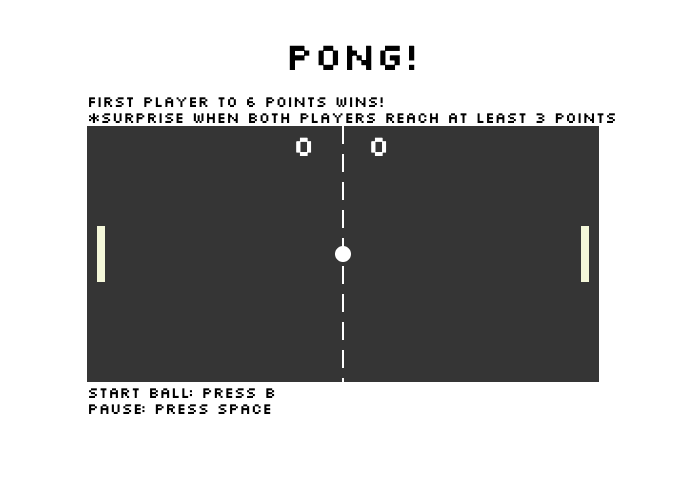

# Pong Game

A basic pong game using SVGs with some twists.

# Installation

## Setup

1. Ensure you have [Node.js](https://nodejs.org/en/) installed first.

2. Clone this project

3. Open project folder in command line. 

4. Run 'npm start'.

5. Access the project at http://localhost:3000.

# Technologies

* JavaScript

* HTML5

* SVG

* Node.js

# Game Features

* Second Ball will trigger simultaneously when both players have 3 or more points

* Ball changes colour when colliding with paddles

* Added a ball start key 'B'

* Game Over text appears and the game is stopped when either player reaches 6 points

* Added Cat meows when ball collides with Paddles

# Personal Learnings

* Began to familiarize with Object Oriented Programming using constructors and functions.

* Learned how to connect multiple js files into one game.js

* Learned how to utilize Node.js to start local servers.

* SVGs are useful in building vector shapes.

# Screenshot

 

# License

This project is licensed under MIT 2019.